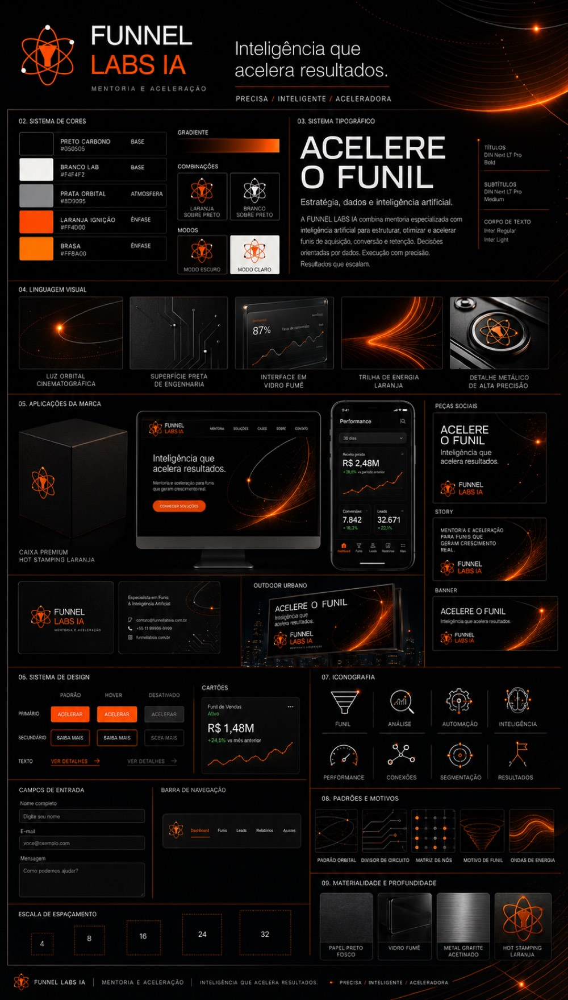

# Pôster de identidade visual a partir do logotipo

Você envia um logotipo e recebe de volta uma prancha única com o sistema
visual inteiro da marca: paleta com códigos HEX, hierarquia tipográfica,
moodboard, mockups de embalagem, site, aplicativo, cartão e outdoor, além de
componentes de interface e iconografia.

Serve para apresentar proposta a cliente, dar cara profissional a um projeto
pessoal ou padronizar a marca de um negócio pequeno ou médio que nunca teve
manual nenhum.

O prompt é um JSON. Isso não é enfeite: a estrutura em blocos faz o modelo
tratar cada seção como um requisito separado, e é o que impede o resultado de
virar um amontoado bonito e desorganizado.

## O prompt

```json
{
  "prompt": {
    "titulo": "Pôster de Sistema de Identidade Visual em Nível de Agência",
    "acionamento": "Envie um logotipo. A partir dele, construa um pôster completo de sistema de identidade visual, com alto valor percebido e digno de investimento — do tipo que conquista clientes e domina as páginas principais do Behance.",

    "diretriz_principal": {
      "regra": "Todos os elementos — cor, tom, forma, textura e personalidade — devem ser extraídos diretamente do logotipo enviado.",
      "aplicacao": "Nada genérico. Nada padronizado. Nada emprestado. Desmonte o logotipo. Decodifique-o. Construa um universo visual completo a partir do DNA dele."
    },

    "formato": {
      "orientacao": "Vertical",
      "proporcao": "4:5",
      "resolucao": "4K vertical — 3840 × 4800 pixels",
      "qualidade": "Ultra-alta definição, detalhes nítidos, acabamento profissional e texto legível",
      "layout": "Grade com múltiplas colunas",
      "composicao": "Em camadas, densa e intencional — nenhum espaço desperdiçado"
    },

    "secoes": {

      "01_cabecalho_da_marca": {
        "rotulo": "Comece com autoridade",
        "elementos": [
          "Nome da marca em tipografia imponente e com alta hierarquia",
          "Declaração da marca — no máximo 6 palavras, precisa e contundente",
          "Três descritores da essência da marca, por exemplo: Autêntica / Futurista / Sólida"
        ]
      },

      "02_sistema_de_cores": {
        "rotulo": "Construa o universo de cores",
        "paletas": {
          "primaria": "De 3 a 5 cores extraídas do logotipo",
          "secundaria": "De 3 a 5 cores de apoio",
          "destaque": "Cores de alto impacto para pontos de ênfase"
        },
        "exibicao_de_cada_cor": [
          "Bloco amplo de amostra da cor",
          "Código HEX",
          "Indicação da função: base / ênfase / atmosfera"
        ],
        "extras": [
          "Misturas em gradiente",
          "Combinações de cor sobre cor",
          "Comportamento no modo claro e no modo escuro"
        ]
      },

      "03_sistema_tipografico": {
        "rotulo": "Estabeleça a voz tipográfica",
        "niveis": {
          "titulo": "Imponente e forte — mostre um exemplo de título curto e marcante",
          "subtitulo": "Estruturado e claro — mostre um exemplo de linha descritiva",
          "corpo": "Legível e intencional — mostre um exemplo de fragmento de parágrafo"
        },
        "requisito": "A hierarquia deve ser inconfundível à primeira vista"
      },

      "04_linguagem_visual": {
        "rotulo": "Defina o universo visual",
        "definir": [
          "Estilo das imagens: editorial / industrial / cinematográfico / orgânico / outros",
          "Qualidade e direção da iluminação",
          "Referências de textura e sensações transmitidas pelos materiais"
        ],
        "quadros_visuais": {
          "quantidade": "De 3 a 5 quadros",
          "estilo": "Prévias visuais com direção de arte — blocos de moodboard que pareçam extraídos do briefing de um ensaio real"
        }
      },

      "05_aplicacoes_da_marca": {
        "rotulo": "Dê vida à marca",
        "regra": "Todos os mockups devem parecer parte da mesma marca. O mesmo DNA. Nenhuma inconsistência.",
        "mockups": [
          {
            "tipo": "Embalagem de produto",
            "detalhe": "Renderização tridimensional e realista"
          },
          {
            "tipo": "Seção principal de site",
            "detalhe": "Tela completa em computador"
          },
          {
            "tipo": "Tela de aplicativo para celular",
            "detalhe": "Um momento central da interface"
          },
          {
            "tipo": "Publicações para redes sociais",
            "detalhe": "Três formatos — quadrado, story e banner"
          },
          {
            "tipo": "Cartão de visita",
            "detalhe": "Frente e verso"
          },
          {
            "tipo": "Publicidade em mídia exterior",
            "detalhe": "Outdoor ou painel de transporte público"
          }
        ]
      },

      "06_sistema_de_design": {
        "rotulo": "Mostre o sistema funcionando",
        "componentes": [
          "Botões — estados padrão, ao passar o cursor e desativado",
          "Cartões",
          "Campos de entrada",
          "Barra de navegação",
          "Escala de espaçamento"
        ],
        "requisito": "Deve se parecer com um documento real de entrega de sistema de design"
      },

      "07_iconografia": {
        "rotulo": "Iconografia",
        "quantidade": "De 6 a 10 ícones",
        "regra_de_estilo": "A mesma gramática visual do logotipo — geométrica, orgânica, angulosa ou suave",
        "consistencia": "Espessura de traço uniforme ou lógica de preenchimento consistente em todo o conjunto"
      },

      "08_padroes_e_motivos": {
        "rotulo": "Padrões e elementos de movimento",
        "origem": "Derivados exclusivamente da geometria do logotipo",
        "elementos": [
          "Padrões de fundo",
          "Formas complementares",
          "Motivos repetidos",
          "Divisores estruturais"
        ],
        "filosofia": "Não são simples decorações — são o DNA da marca tornado visível"
      },

      "09_materialidade_e_profundidade": {
        "rotulo": "Materialidade e profundidade",
        "detalhes": [
          "Sombras com lógica direcional realista",
          "Texturas de superfície — vidro, fosco, papel ou metal, conforme a identidade da marca",
          "Reflexos quando forem adequados ao contexto",
          "Profundidade entre camadas que faça os elementos parecerem fisicamente presentes"
        ]
      }
    },

    "escala_desejada": {
      "total_de_elementos": "De 30 a 50 elementos visuais distintos",
      "equilibrio": "Grandes elementos de ancoragem equilibrados por microdetalhes refinados",
      "regra": "Sem enchimento. Sem espaços artificiais. Cada centímetro deve justificar sua presença."
    },

    "padrao_de_qualidade": {
      "referencia_de_valor": "Deve parecer uma produção de US$ 15.000",
      "referencias": [
        "Estudo de caso de identidade visual de alto nível no Behance",
        "Prancha real de diretrizes de marca criada por uma agência",
        "Material final pronto para apresentação ao cliente"
      ],
      "condicoes_de_falha": [
        "Parecer um modelo pronto ou genérico",
        "Conter espaços reservados genéricos",
        "Os elementos parecerem desconectados",
        "Qualquer seção parecer inacabada ou vazia",
        "A imagem não possuir resolução 4K vertical de 3840 × 4800 pixels",
        "Textos borrados, deformados ou ilegíveis"
      ]
    }
  }
}
```

## Como usar

Este prompt não tem variáveis para preencher. O que ele exige é uma coisa só,
e é a que todo mundo esquece:

1. **Envie o logotipo na mesma mensagem do prompt.** Sem a imagem anexada, o
   modelo inventa uma marca do zero e o resultado não serve para nada. O
   arquivo pode ser PNG ou JPG, de preferência com fundo transparente ou
   fundo liso.
2. Cole o JSON inteiro, das chaves de abertura às de fechamento.
3. Peça a geração da imagem.

Nada mais precisa ser editado para funcionar.

## Dicas

- **Logotipo simples gera resultado melhor.** O prompt extrai paleta e formas
  do que você enviou. Logotipo com muita cor e muito detalhe produz um sistema
  visual confuso, porque não existe DNA claro para decodificar.
- **Quer direcionar o clima?** Acrescente uma linha depois do JSON, do tipo
  "a marca é sofisticada e discreta, evite laranja". Instrução em texto
  corrido depois da estrutura funciona melhor que editar o JSON.
- **Texto saiu borrado ou torto?** É a limitação mais comum na geração de
  imagem. Peça a regeneração citando a condição de falha: "refaça, os textos
  precisam estar nítidos e legíveis".
- **Para apresentar ao cliente**, gere duas ou três versões e escolha. O custo
  é o mesmo e a variação entre elas costuma ser grande.
- Você pode trocar os itens da lista de mockups por outros que façam sentido
  para o negócio, como uniforme, fachada, frota ou cardápio.

## Exemplo de resultado

Gerado a partir de um único logotipo enviado ao ChatGPT, sem nenhuma edição
posterior:


