# 25 skills de imagem para o Codex

Mande uma foto para o Codex, digite o nome do efeito e ele devolve a foto
transformada com o GPT Imagens: em Lego, derretendo, em raio-x, debaixo d'água,
virando videogame e mais 20 efeitos. São 25 skills gratuitas, prontas para
instalar.

---

## Instalação com um link

1. Abra o Codex (aplicativo, extensão do editor ou terminal).
2. Copie a mensagem abaixo, cole no Codex e envie:

```
Instale as skills deste link: https://github.com/AndreCia/prompts-e-skills/tree/main/skills/25-skills-imagens
```

3. Se o Codex pedir permissão para baixar o arquivo, aprove.
4. Feche e abra o Codex de novo.
5. Teste: anexe uma foto e escreva `$lego`.

As skills funcionam no **Codex**. No aplicativo do ChatGPT elas não se
instalam.

---

## Para o Codex: como instalar

Se você é o agente que recebeu este link, siga estes passos e mostre ao
usuário o que fez.

1. A pasta de destino é `$CODEX_HOME/skills`; sem `CODEX_HOME`, é
   `~/.codex/skills` (no Windows, `%USERPROFILE%\.codex\skills`). Crie a pasta
   se ela não existir.
2. Baixe o pacote, que traz as 25 pastas dentro de `25-skills-imagens/`:
   `https://raw.githubusercontent.com/AndreCia/prompts-e-skills/main/skills/25-skills-imagens/25-skills-imagens.zip`
3. Descompacte numa pasta temporária.
4. Antes de copiar, veja se já existe no destino alguma pasta com o mesmo nome
   de uma das 25. Se existir, pare e pergunte ao usuário se pode substituir.
5. Copie as 25 pastas para o destino, cada uma com `SKILL.md`, `agents/` e
   `references/`.
6. Confira se as 25 estão no destino, cada uma com o seu `SKILL.md`.
7. Diga ao usuário quais entraram e peça que reinicie o Codex. Para testar:
   anexar uma foto e escrever `$lego`.

macOS e Linux:

```bash
DEST="${CODEX_HOME:-$HOME/.codex}/skills"
TMP="$(mktemp -d)"
curl -fsSL -o "$TMP/pacote.zip" https://raw.githubusercontent.com/AndreCia/prompts-e-skills/main/skills/25-skills-imagens/25-skills-imagens.zip
unzip -q "$TMP/pacote.zip" -d "$TMP"
mkdir -p "$DEST"
for d in "$TMP/25-skills-imagens"/*/; do n="$(basename "$d")"; [ -e "$DEST/$n" ] && echo "já existe: $n"; done
# só depois de o usuário autorizar a troca das que já existem:
cp -R "$TMP/25-skills-imagens"/* "$DEST"/
ls "$DEST"/*/SKILL.md | wc -l
```

Windows (PowerShell):

```powershell
$Dest = if ($env:CODEX_HOME) { "$env:CODEX_HOME\skills" } else { "$HOME\.codex\skills" }
$Tmp = Join-Path $env:TEMP "skills-imagens"
Invoke-WebRequest "https://raw.githubusercontent.com/AndreCia/prompts-e-skills/main/skills/25-skills-imagens/25-skills-imagens.zip" -OutFile "$Tmp.zip"
Expand-Archive "$Tmp.zip" -DestinationPath $Tmp -Force
New-Item -ItemType Directory -Force $Dest | Out-Null
Get-ChildItem "$Tmp\25-skills-imagens" -Directory | Where-Object { Test-Path "$Dest\$($_.Name)" } | ForEach-Object { "já existe: $($_.Name)" }
# só depois de o usuário autorizar a troca das que já existem:
Copy-Item "$Tmp\25-skills-imagens\*" $Dest -Recurse -Force
(Get-ChildItem "$Dest\*\SKILL.md").Count
```

---

## Instalação manual

1. Baixe o pacote:
   [25-skills-imagens.zip](https://raw.githubusercontent.com/AndreCia/prompts-e-skills/main/skills/25-skills-imagens/25-skills-imagens.zip).
2. Descompacte. Dentro de `25-skills-imagens/` estão as 25 pastas.
3. Copie as 25 pastas para `~/.codex/skills` (no Windows,
   `%USERPROFILE%\.codex\skills`). Se a pasta `skills` não existir, crie.
4. Feche e abra o Codex de novo.

---

## Como usar

Anexe uma foto no Codex e escreva o comando do efeito, por exemplo `$derreter`.
Também vale escrever `/derreter` no meio do pedido. Dá para acrescentar
detalhes: "`$gigante` com o cachorro do tamanho de um prédio, mantendo o fundo".

A edição usa a ferramenta de imagens que já vem no Codex: não precisa de chave
de API nem de instalar mais nada. A foto original fica preservada; o resultado
sai num arquivo novo.

| # | Comando | O que faz |
|---|---|---|
| 1 | `$ikea` | Desmonta parte da imagem em peças suspensas, com parafusos e setas, como um manual da IKEA |
| 2 | `$lego` | Reconstrói a cena com peças de LEGO |
| 3 | `$massinha` | Transforma tudo em massinha, com marcas de dedos, como animação em stop motion |
| 4 | `$origami` | Recria os elementos em papel dobrado |
| 5 | `$papercut` | Transforma a imagem em camadas de papel recortado |
| 6 | `$minecraft` | Reconstrói a imagem como um mundo de Minecraft |
| 7 | `$cartoon` | Transforma a imagem em cena de animação 3D |
| 8 | `$hq` | Recria a cena como página de quadrinhos |
| 9 | `$escher` | Transforma a cena numa construção impossível, com escadas e perspectivas que desafiam a lógica |
| 10 | `$holograma` | Transforma o assunto numa projeção holográfica |
| 11 | `$pixel` | Converte a imagem em pixel art |
| 12 | `$gigante` | Aumenta o assunto até uma escala monumental |
| 13 | `$diorama` | Transforma a cena numa miniatura sobre uma base |
| 14 | `$fliperama` | Transforma a imagem num jogo de fliperama, com placar e cenário |
| 15 | `$adesivo` | Cria um adesivo recortado do assunto, com fundo transparente |
| 16 | `$blueprint` | Transforma o assunto num desenho técnico |
| 17 | `$raiox` | Mostra o interior do assunto como uma radiografia |
| 18 | `$corte` | Abre um corte no objeto para mostrar o que tem dentro |
| 19 | `$gravidadezero` | Faz pessoas, objetos e líquidos flutuarem |
| 20 | `$submerso` | Coloca a cena inteira debaixo d'água |
| 21 | `$abandonado` | Mostra a cena depois de décadas de abandono |
| 22 | `$biomecanico` | Funde o assunto com engrenagens, cabos e articulações |
| 23 | `$derreter` | Faz partes da imagem escorrerem, como numa cena surrealista |
| 24 | `$miniuniverso` | Transforma o assunto num pequeno mundo habitado |
| 25 | `$portal` | Faz o assunto atravessar uma moldura e sair da imagem |

---

## Antes e depois

À esquerda, a foto original; à direita, o resultado do efeito.

**1. IKEA**
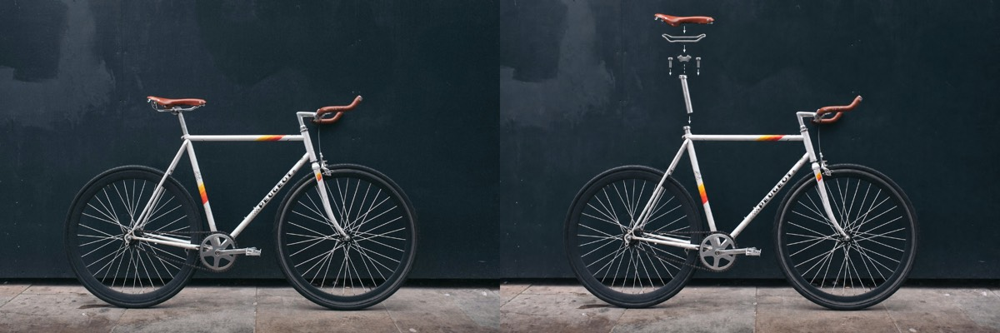

**2. Lego**
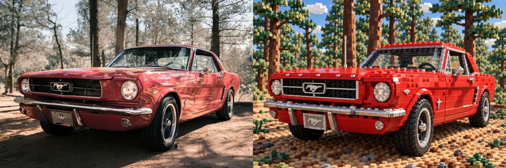

**3. Massinha**
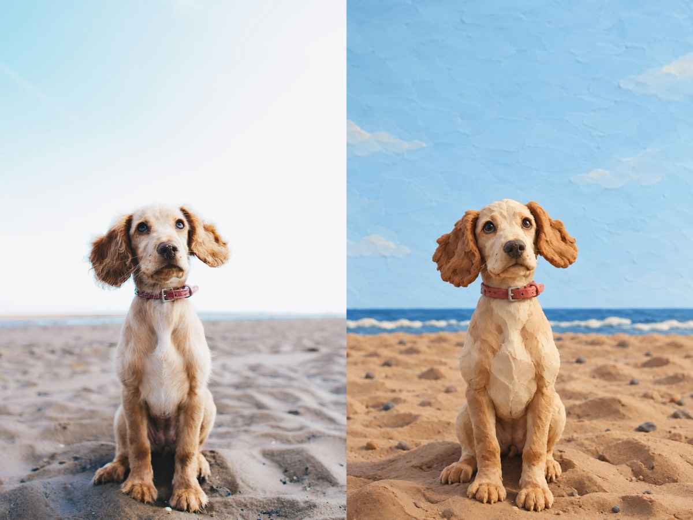

**4. Origami**
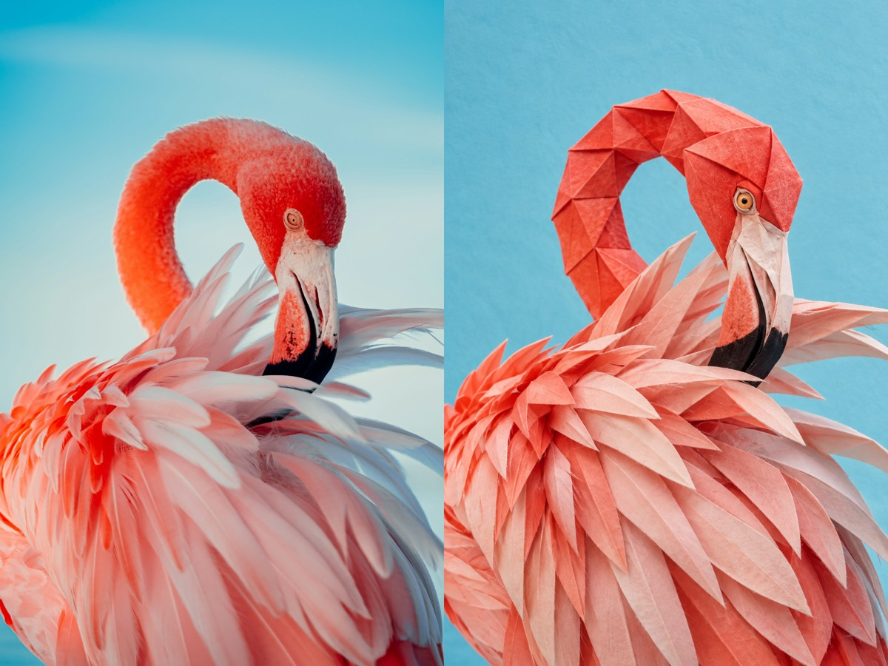

**5. Papercut**
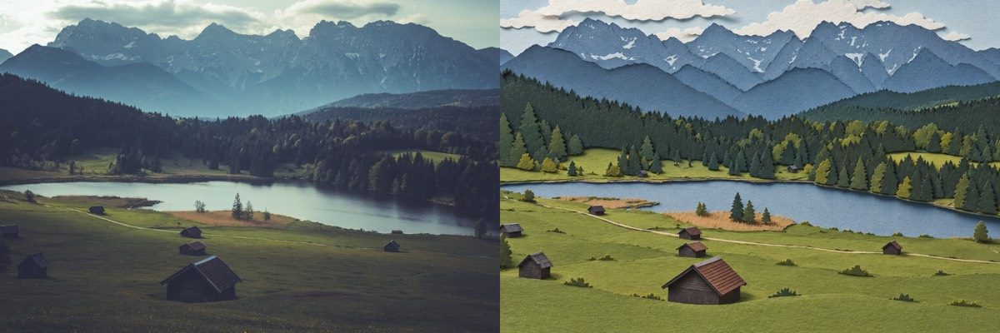

**6. Minecraft**
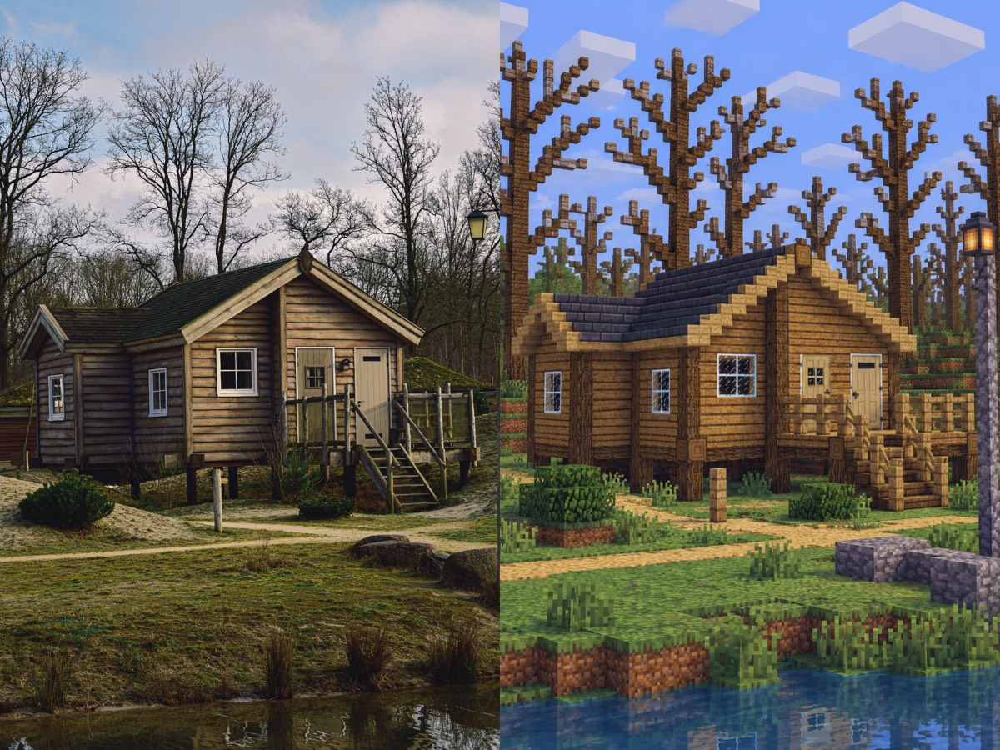

**7. Cartoon**
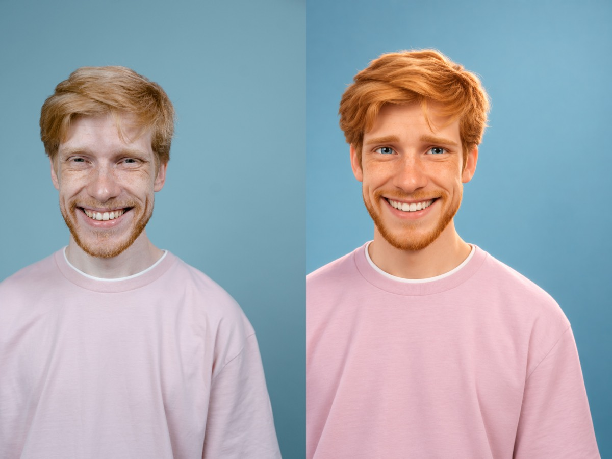

**8. HQ**
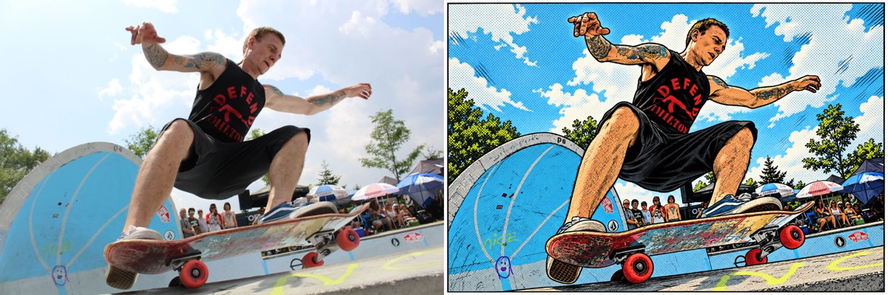

**9. Escher**


**10. Holograma**


**11. Pixel**
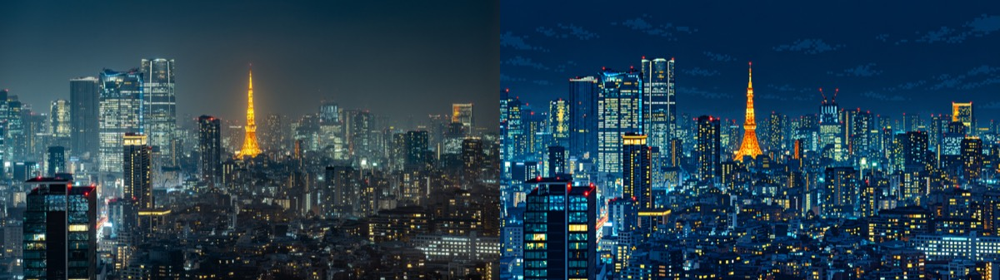

**12. Gigante**
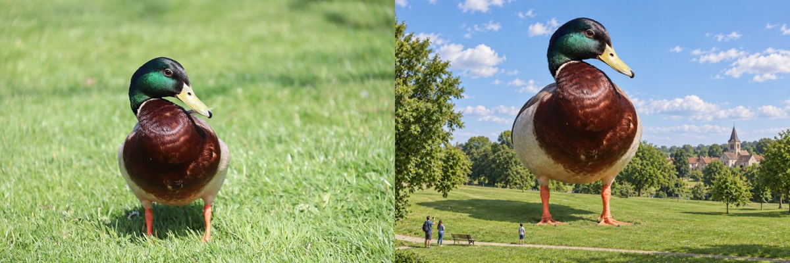

**13. Diorama**
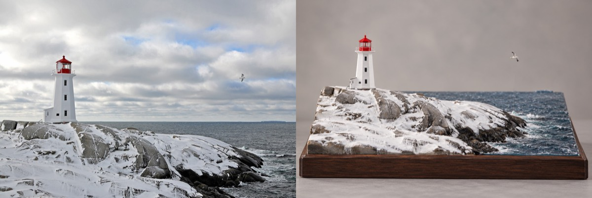

**14. Fliperama**
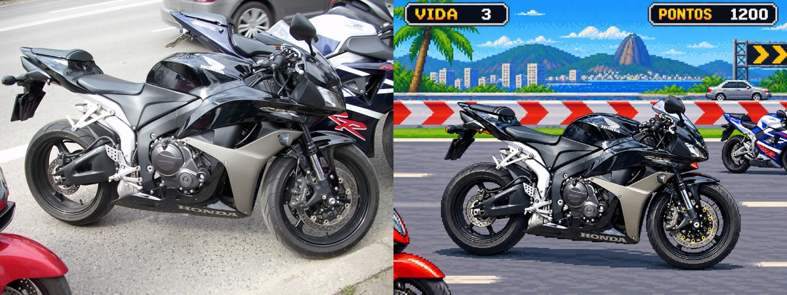

**15. Adesivo**
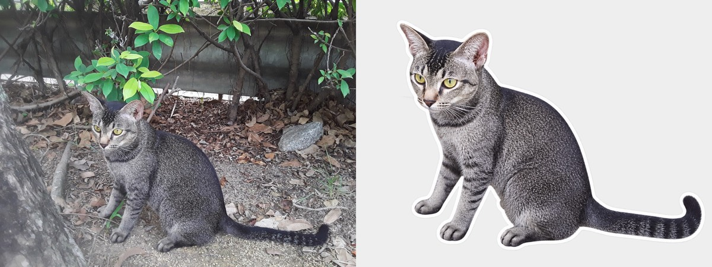

**16. Blueprint**
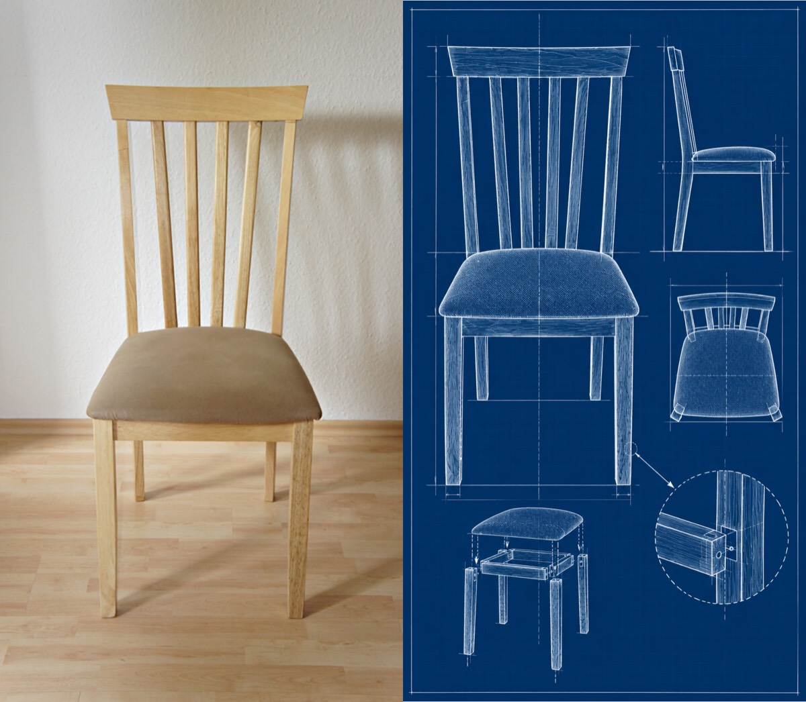

**17. Raio-X**
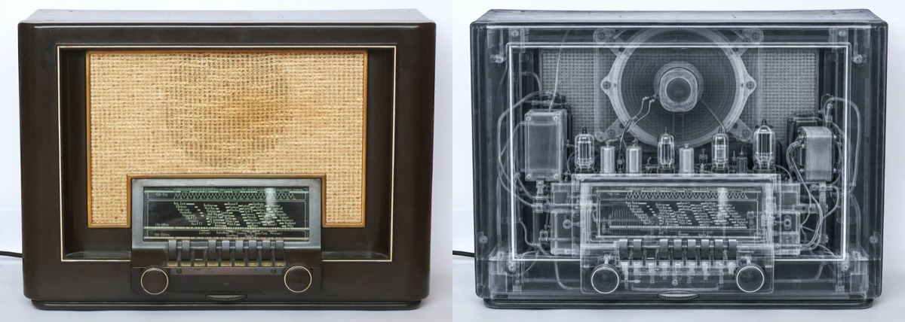

**18. Corte**
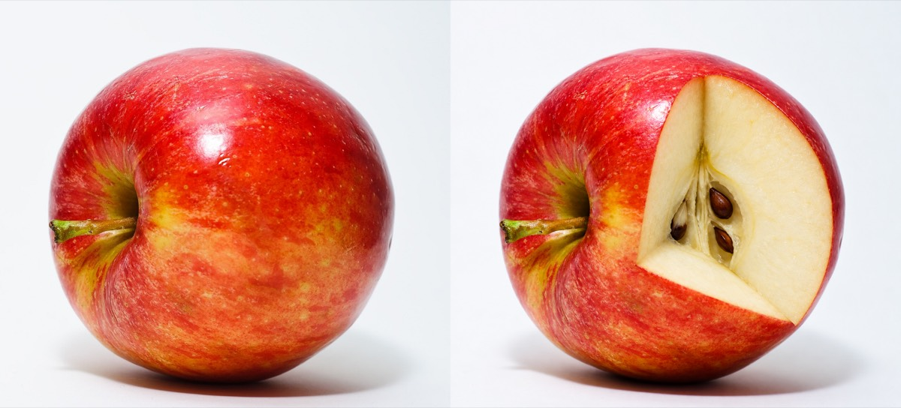

**19. Gravidade Zero**
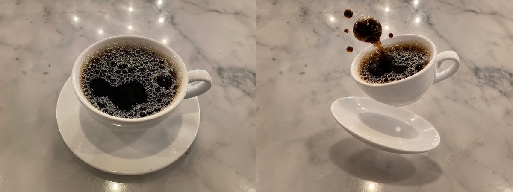

**20. Submerso**
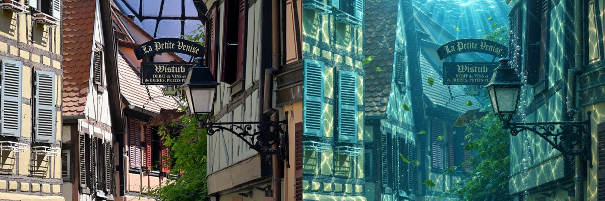

**21. Abandonado**
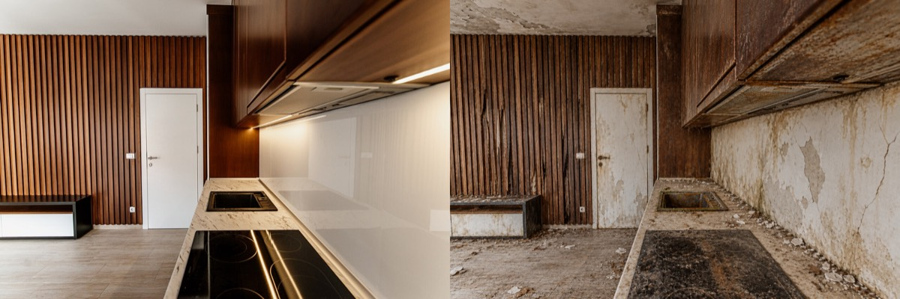

**22. Biomecânico**
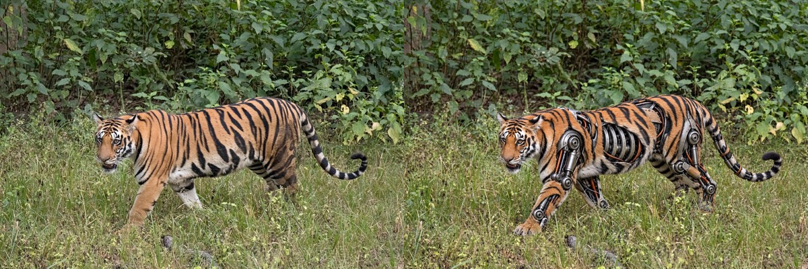

**23. Derreter**
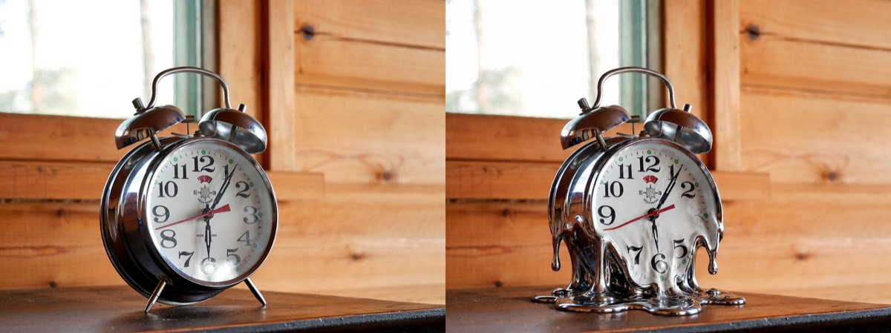

**24. Miniuniverso**
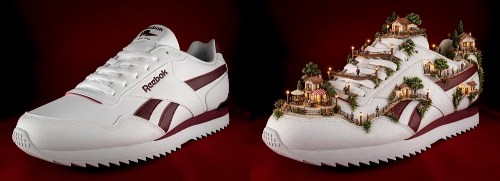

**25. Portal**
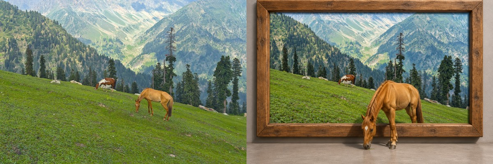

---

## Créditos das fotos

As fotos originais dos exemplos são de bancos com licença aberta (Unsplash,
Pexels e Wikimedia Commons). Autor, fonte e licença de cada uma estão em
[CREDITOS.md](CREDITOS.md). As imagens transformadas são adaptações dessas
fotos e seguem a licença da foto de origem.

Voltar para a [lista de skills](../README.md).
